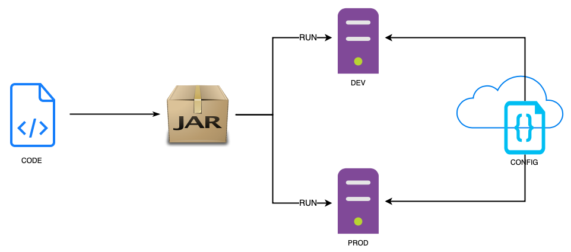
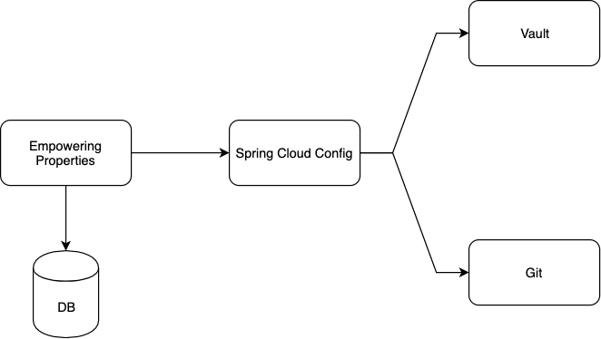

### Tiberiu Tofan
---
#### Programmer @ ING Tech
#### SWAT CHAPTER
#### Advocate Trunk-based development, continuous deployment, automating everything


### History
<!-- -- data-transition="none" -->
---


### History
<!-- -- data-transition="none" -->
---
```java
public class Constants {

    public static final String DATABASE_URL = "jdbc:***";
    public static final String DATABASE_USERNAME = "***";
    public static final String DATABASE_PASSWORD = "***";

    //1000 more constants

}
```


### History
<!-- -- data-transition="none" -->
---
```diff
-public class Constants {
-
-    public static final String DATABASE_URL = "jdbc:***";
-    public static final String DATABASE_USERNAME = "***";
-    public static final String DATABASE_PASSWORD = "***";
-
-    //1000 more constants
-
-}
```


### Goals
---
- Separate configuration from code
- Provide configuration directly to the running environment
- Scale horizontally
- Every build is a release candidate


### Goals
---


## Empowering Properties
---


### Highlights
---
- From @Value to type-safe properties
- Separate configuration from code
- Centralized configuration
- Update property values at runtime
- Feature toggles


### `@Value`
---
Note: 
- New simple Spring app - no extra modules
- Hard-coded "Hello World" property
- `@Value`
- `application.property`
- `application.yaml`


### `@ConfigurationProperty`
---
- Maps properties to classes
- Validation with Java Validation API (JSR-303)
- Documentation with Javadoc
- Generate auto-completion metadata using `spring-boot-configuration-processor`


### Secure properties
---
#### Jasypts (Java Simplified Encryption)
```xml
<dependency>
        <groupId>com.github.ulisesbocchio</groupId>
        <artifactId>jasypt-spring-boot-starter</artifactId>
        <version>2.1.2</version>
</dependency>
```
```
@EnableEncryptableProperties
```
```yaml
jasypt:
  encryptor:
    property:
      prefix: "ENC@["
      suffix: "]"
```
```
jasypt.encryptor.password
```


### Common application properties
---
- most `starter` projects allow configuration by properties
- `debug`
- `logging.level.*`
- `spring.banner.location`
- `server.port`
- `spring.datasource.url` & `spring.datasource.password`
- a more comprehensive list is available [here](https://docs.spring.io/spring-boot/docs/current/reference/html/appendix-application-properties.html)


### Overriding property values
---
- Command line arguments
- `SPRING_APPLICATION_JSON`
- Java System properties
- OS environment variables
- Application properties outside the jar (`./config`, `.`)
- Application properties packed in the jar (`classpath:/config`, `classpath:/`)
- @PropertySource annotations

Note: 
ConfigFileApplicationListener


### Overriding property values (tests & local dev)
---
- Devtools global settings properties (`$HOME/.config/spring-boot`)
- `@TestPropertySource`
- `@SpringBootTest(properties="...")`
- `test/resources`


### Externalised Configuration
---


### Centralised Configuration
---



### Centralised configuration
---
#### etcd
#### Consul
#### Zookeeper
#### Spring Cloud Config


### Secure properties
---
#### Vault behind Spring Cloud Config
#### Spring Cloud Vault


### Runtime property update
---
`@RefreshScope`


### Demo Application
---



### Feature Toggles
---


### Goals
---
- Separate configuration from code
- Provide configuration directly to the running environment
- Scale horizontally
- Every build is a release candidate


##### https://github.com/empowering-properties
---

